# Kid-Friendly Kayak Adventures

## Table of Contents
* [Introduction](#introduction)
* [But I don't know how to kayak!](#but-i-dont-know-how-to-kayak)
* [But I don't know how to fish!](#but-i-dont-know-how-to-fish)
* [So how can I teach my kids to kayak and fish when I barely know how?!](#so-how-can-i-teach-my-kids-to-kayak-and-fish-when-i-barely-know-how)
* [List of Adventures](#list-of-adventures)
  * [Big Bend Country](#big-bend-country)
  * [Gulf Coast](#gulf-coast)
  * [Hill Country](#hill-country)
  * [Panhandle Plains](#panhandle-plains)
  * [Pinewoods](#pinewoods)
  * [Prairies and Lakes](#prairies-and-lakes)
  * [South Texas Plains](#south-texas-plains)

## Introduction
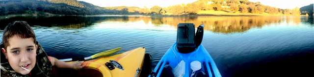

This is a repository of kayak adventures that are kid and family friendly
within the state of Texas.  As a father of three kids developing a love of
kayaking and kayak fishing, I've found that I am often spending a good amount of
effort planning our adventures, trying to answer questions like:

* Is this river, lake or bay appropriate for a child learning to kayak and/or
fish?
* How long is it going to take?  Kids tend to have a time tolerance for
activities before they get bored and then it becomes a negative experience for
all involved
* Are there any particular hazaards that I should be aware of?  There are
risks you might take with yourself that you wouldn't with your kids.
* What are some of the stop and step out opportunities available?  Kids can
enjoy longer trips if you can let them swim, wade, explore an island, and
otherwise make for a varied experience
* When should I go?
* What should we fish with?
* Where can I put in and take out?
* Where can we stay or camp?
* Who can help me with logistics like shuttling, if necessary?
* Where can I keep track of current conditions to know if its appropriate to go
on a particular date?

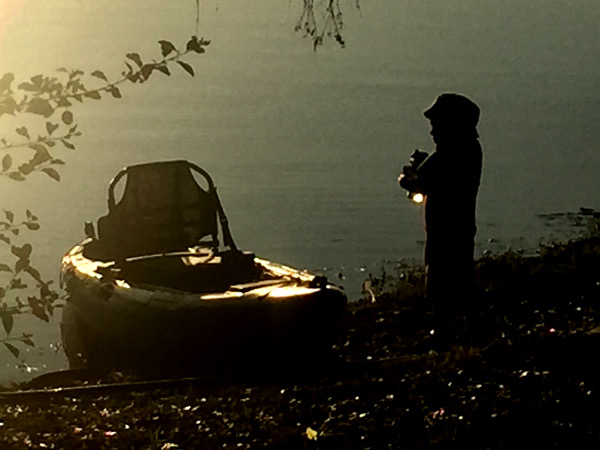

Most of this information, especially the kid-friendly aspect, is not collected
anywhere.  You have to search for it online, talk to people with experience
and infer it from sources targetted to different audiences (a river boring to
whitewater enthusiasts might be PERFECT for your neophyte kid kayaker). So
rather than collecting this information solely for my own use, I've decided to
create this open-sourced community E-Book containing trip plans for kayaking and
kayak fishing from the family perspective.

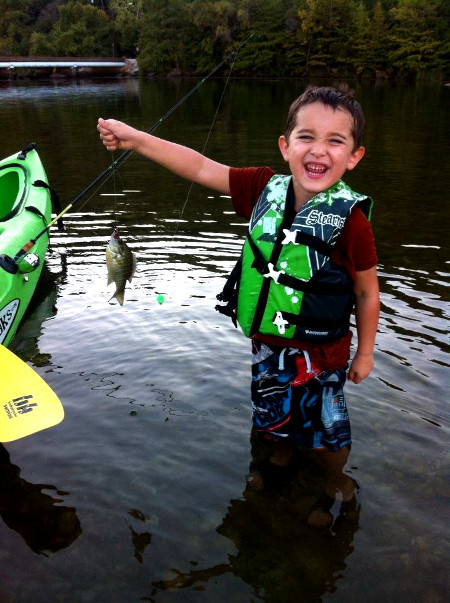

As an open-source community E-Book, this is not my book.  Its OUR book.  You
can, and I hope will, contribute.  If you are a father, mother, uncle, aunt,
brother or sister that takes children kayaking and/or kayak fishing, you have
knowledge that can help broaden the experience of others looking to do the same.
Making this information easily accessible may help overcome the intertia that is
preventing people from even trying.

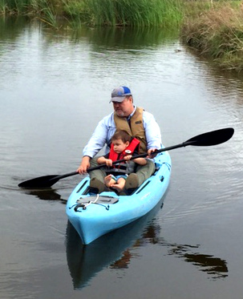

My hope is that this collected information will help instill a love of
kayaking, fishing and the outdoors within the next generation.  And the
generation after that!  If children are the future, then that means they are
the future of these sports we adore and the environment they may be experienced
in.  They are the inheritors, stewards and protectors of this legacy of the
wild.

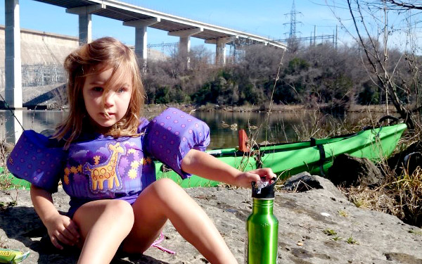

But they can't protect what they don't value, and they can't value what is
unknown.  Its up to us to introduce our children to mother nature and all of her
subtle glories.  The adventures described here can help you make this happen.

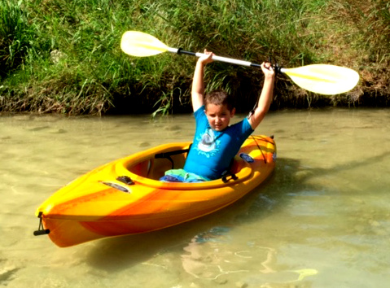

If you are an experienced kayaker and/or kayak fisherman, you probably just want
to get to the "[List of Adventures](#list-of-adventures)".  If you are new to
kayaking, head to "[but I don't know how to kayak!](#but-i-dont-know-how-to-kayak)"
If you are new to fishing, head to "[but I don't know how to fish!](#but-i-dont-know-how-to-fish)"
If you want
some tips for how to get your children into kayaking and fishing, check out
"[So how can I teach my kids to kayak and fish when I barely know how?!](#so-how-can-i-teach-my-kids-to-kayak-and-fish-when-i-barely-know-how)"

## But I don't know how to kayak!
There are two rules you should always follow:

1.  Always wear your personal flotation device (PFD)
2.  Don't kayak alone

The most enjoyable way to learn to kayak is to have a friend teach you.  If you
don't have friends that kayak, find a rental shop on the water near where you
live and make sure you will get some instruction with a rental.  Some shops may
offer classes, and these are a good way to get more instruction.  Finally, there
are many resources online to help educate yourself about kayaking paddling,
water safety, and so forth.
[Paddling.net's how to series](https://www.youtube.com/playlist?list=PLAAwPODhQmrnlFUZAdNtfSjn4MlOIj3CT)
is one such example.

## But I don't know how to fish!
The best way to learn to fish is to have a friend teach you.  If that isn't
an option, then teach yourself to fish for panfish with worms.  This is the most
reliable way to catch fish with a frequency that will keep you (and younger
children) interested.  You will need the following gear available at your
nearest sporting goods store:

1. Baitcasting Rod & Reel Combo
2. Bobbers
3. Hooks (size 8)
4. Worms

[This video on youtube](https://www.youtube.com/watch?v=ztrUivAImhY) will
demonstrate how you can catch panfish with this gear.

## So how can I teach my kids to kayak and fish when I barely know how?!
With children under the age of 7 or 8, you don't.  You take them
kayakng or kayak fishing *with* you.  Stick a stadium seat in the back well
of your kayak and let them tag along while you paddle and/or fish.

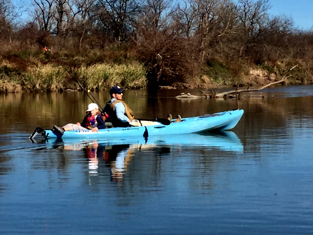

I've found my kids and I had the best experiences when I didn't have any
expectations and I let them lead our journey on the  water.  If they wanted to
fish, we would fish.  This was somewhat rare and would only last 15 minutes or
so unless there was some consistent action.  More often, they wanted to chase
ducks, or turtles, or to paddle to an island to get out and explore.  If that is
what they wanted, that is what we would do.  The times I tried to force an
agenda wound up being the times that were the least enjoyable.

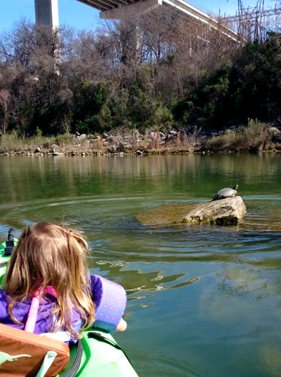

With kids these ages, they are done when they are done.  Don't press it, even if
the trip was relatively short. The worst thing you can do is give them a
negative experience kayaking or fishing.  They will associate
your passion with unpleasant feelings and that can sabotage their ability to
enjoy these activities with you in the future when they are older. And heaven
help the poor soul trapped on a kayak with a screaming 3 year old that was
pushed too far.

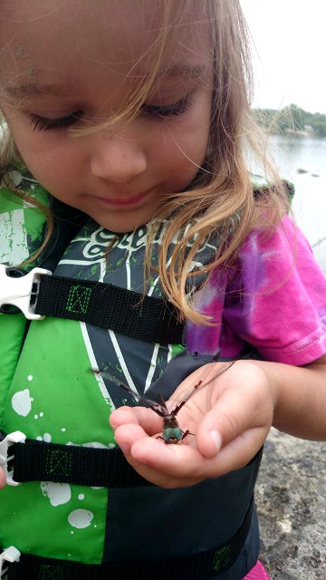

Younger children may not be as enthusiastic as you are.  Mine
weren't.  I would sometimes get push back about "having to go kayaking".
Too bad, little squirt.  Daddy needs some outside time, so buckle up.  This may
seem odd since I just got through saying you should let your kids be in charge
and to avoid negative experiences at all costs.  The thing is, once we got
on the water, and if I let them decide what we were going to do on the water,
they would have a blast.  They always said they had a great time and before long
they were asking me to go kayaking.

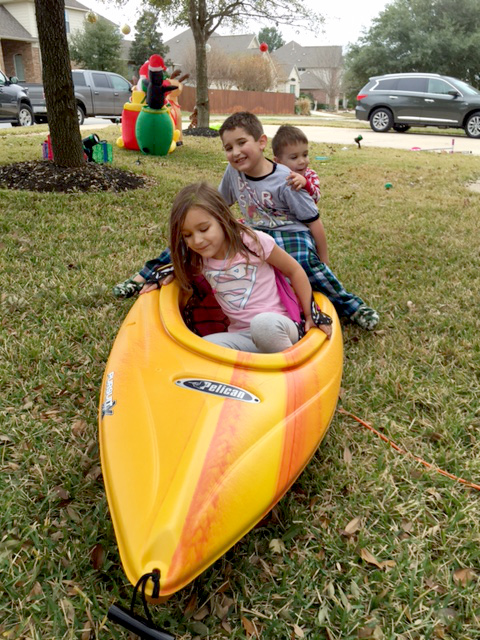

As the kids get to be 6 or 7, you can start considering letting them kayak
themselves.  I went ahead and bought my son his first kayak at 7 as a
Christmas present.  I took him for some one-on-one time in a small creek
that was barely moving and about shin deep.  There he learned paddling
basics, chasing tennis balls I would throw for him.  That he could step
out of his kayak and stand in knee deep water made us both very comfortable
until he got adept at maneuvering his kayak.

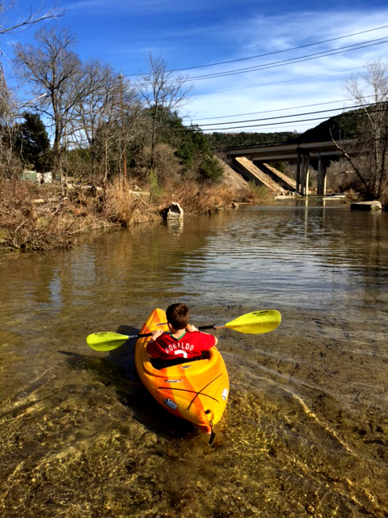

Before long, we moved to lakes with him tethered to my kayak.  A
rope with carabiner on both end will do the trick.  You can easily attach
to the child's kayak bow (front) handle and your kayak's stern (rear) handle.
My son enjoyed these trips tremendously.  He would paddle some, then rest some
while I towed him, then paddle some more.  He did not feel comfortable
fishing from the kayak at this time, so we would take rods and find a spot
to beach and shore fish.

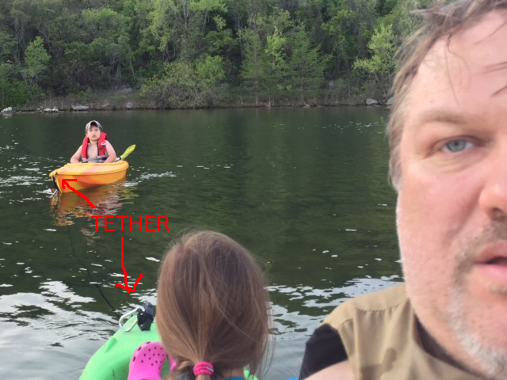

On our 5th or 6th tethered outing, my son said he wanted to try paddling just
by himself.  So we detached in a little fork of Lake Travis, and he paddled his
first real water without any help whatsoever.  He did awesome, making 8 laps and
wearing himself out.  I was one proud papa.

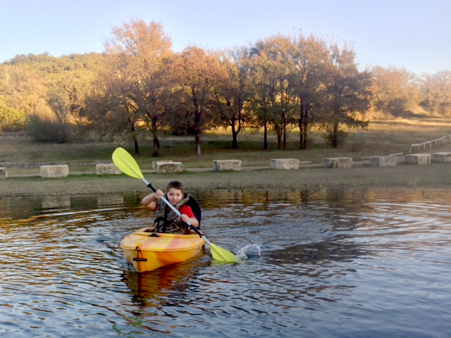

He is 8 now, and completely hooked.  My daughter is 6, and while she hasn't been
hooked quite as thoroughly, she enjoys it as well and is looking forward to
getting brother's hand me down -- painted pink.  My youngest is 4, and he tags
along for the ride on the stadium seat and loves playing in the water and
shooting at his older brother with the water gun.

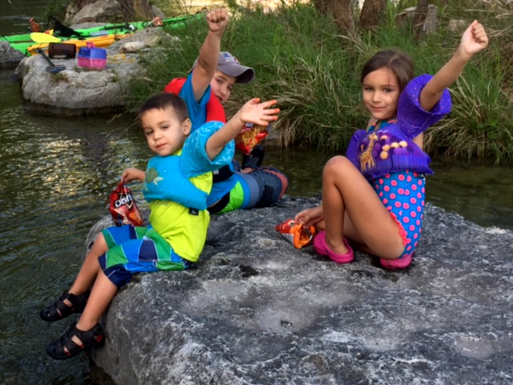

If your children are older than this, you can and probably should get them
started paddling a kayak by themselves.  They will have the physical ability and
should be able to listen and learn while being safe which younger kids will
struggle with.  Piloting their own yak will be more fun and interesting for
them as opposed to the passive ride-along experience more appropriate for
younger children.

Finally, the community of Texas kayak fisherman are helpful and patient towards the
unitiated.  Join the [Texas Kayak Fisherman](https://www.facebook.com/groups/TKFisherman/)
facebook group and tune in to the discussions and ask your questions.  You will
get a lot of helpful advice to give you and your kids new adventures to look
forward to.

## List of Adventures
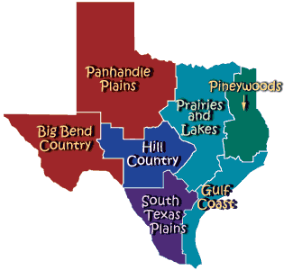

### Big Bend Country
TBW

### Gulf Coast
TBW

### Hill Country
* Rivers
  * [South Llano River 2 Day Kayak Camping Adventure!](plans/south_llano_river_2_day_kayak_camping_adventure/README.md)

### Panhandle Plains
TBW

### Pinewoods
TBW

### Prairies and Lakes
TBW

### South Texas Plains
TBW
