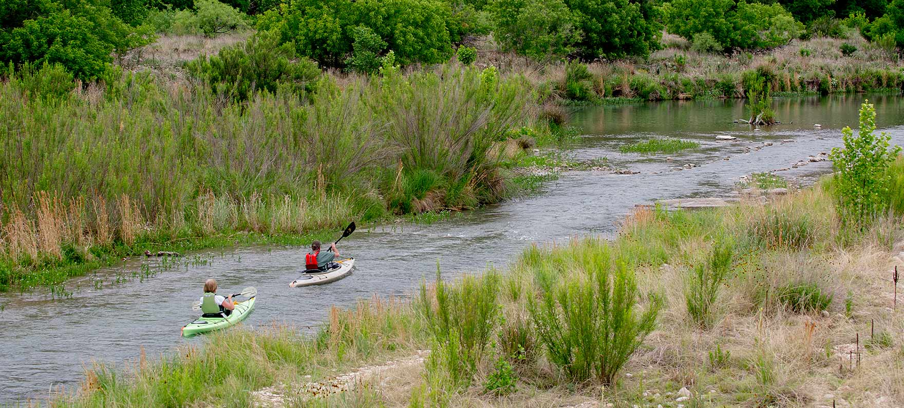
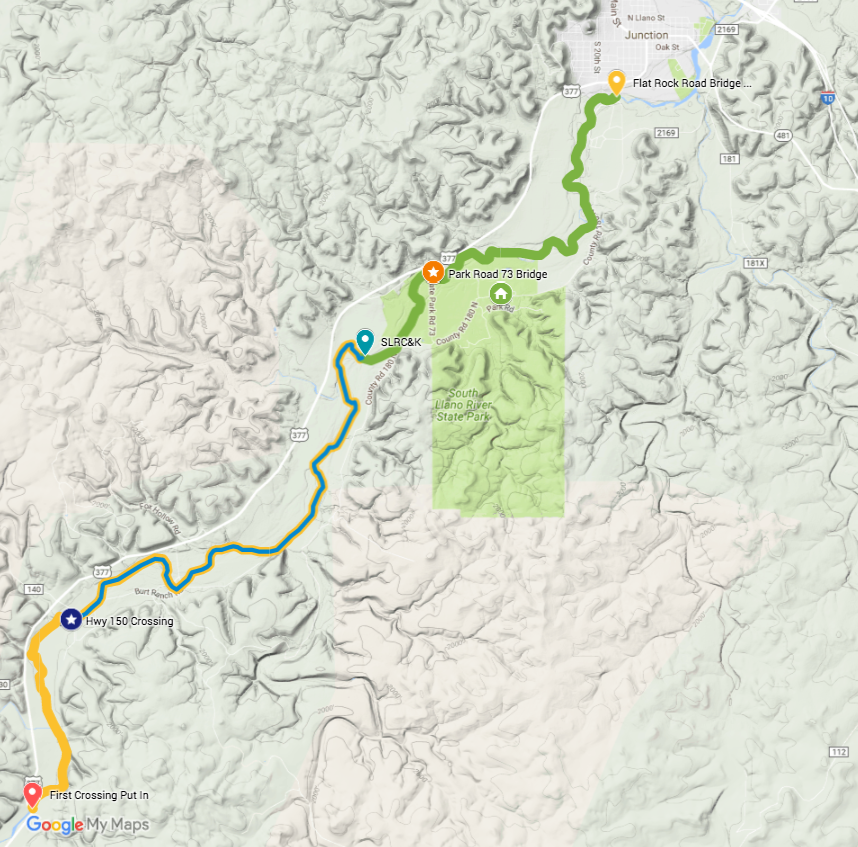

# South Llano River 2 Day Kid-Friendly Kayak Camping Adventure

## Overview
* Location:  near Junction, TX
* Water Type:  River
* Trip profile:  Multi-day camping
* Duration: 3 day (2 night)
* Best Time:  Spring, Fall
* Avoid If:  Flow is 100 CFS or less
* Paddling Difficulty:  Easy
* Ages:
  * 4-7: in tandem kayak with adult
  * 7+ in own kayak

## Itinerary
* Day 1
  * Arrive Llano River State Park
  * Set up camp
  * Prepare for Day 2
* Day 2
  * Drive to South Llano River Canoes & Kayaks
  * Leave cars & shuttle to 1st Highway 377 crossing
  * Paddle/Float ~10.7 miles to SLRC&K
    * Approximately 5 hours paddling, 6-7 hours with stops for wading, swimming
  * Leave kayaks at SLRC&K
  * Drive to campsite at Llano River State Park
  * Sleep!
* Day 3
  * Pack up camp
  * Drive to SLRC&K & launch
  * Have cars shuttled to Flat Rock Bridge
  * Paddle/float ~6.0 miles to Flat Rock Bridge
    * Approximately 3 hours paddling, 4-4.5 hours with stops for wading, swimming
  * Load kayaks and head home
* Day 2 or 3 Alternative
  * Drive to South Llano River Canoes & Kayaks
  * Leave cars & shuttle to highway 150 crossing
  * Paddle/Float ~6.29 miles to SLRC&K
    * Approximately 3 hours paddling, 4-4.5 hours with stops for wading, swimming
  * Exit river at SLRC&K
  * Would be more appropriate for younger kids than the 6-7 hour leg described
  above

## Trip Information
### From Jim Gattis via Texas Kayak Fisherman Facebook Group
I have done this trip many times! Over 20. It's a great float and always has good flowing spring feed water. I've done it w all ages of kids 5 and up. You are limited to the park on camping. It's a 5 hour float from the park to Flat Rock bridge. The park ranger can arrange a shuttle for you. I've floated many of the rivers in central Tx and W. Tx. This is the best suited for kids as it's canyon country and you normally don't have to contend w wind bc u are down low. There are two low crossings up from the part towards Telegraph. I would put in at the first one. It's a 5-6 hour float from there to the park. The park is very nice and does fill up quickly so make reservation accordingly. If you fish it use small grubs, spinners or shad rap style. The smaller the better, 1/8 once or 1/4 once. Flat Rock bridge is adjacent to the Texas Tech campus. I do not recommend floating down from Flat Rock to the city park it's not as scenic as the other floats mentioned above. Hope this help.

### From Mike Van Nattan via Texas Kayak Fisherman Facebook Group
I fish upstream from the park regularly. It's a fantastic stretch of river and I've caught my personal best run of bass in 2 hours time up that stretch.

First, Curtis Thomas (South Llano River Canoes & Kayaks) has land upstream from the park and will do shuttle service for you. Since it's a little above half way to Flat Rock you may be able to get him to let you camp on his land - he's got a bathroom on site to use and a great landing area. Not sure if he's still there but we talked to him last summer. Give him a call.

Second, if you stay at the campground, they insist that you get a camping spot. At least they did when I asked. But I'm guessing if you stayed on the bank they might leave you alone since you'd be "in the river" and of course, they know the rules.

As for ease of paddling: This river has it's ups and downs. There are places where we've *always* had to get out and there's others where it comes and goes. Learning the right way to hit a rapids is critical. Oh and keep your rods down because there are several low hanging trees at the end of a rapids.

For lures, I aim for Guadalupe Bass the most so I carry an ultralight and throw a white lure. Usually a mini-buzzbait in summer, or a spinnerbait or roostertail during the winter. There are huge alligator-weed weedbeds all along this stretch of river with a few new patches of lily pads - you can guess what I'm about to say: Take a frog! Dead Ringer or other super soft worms work well on this stretch for largies. But to be quite honest, my PB I mentioned above was caught on a white. Booyah mini pond magic buzzbait. Was around 30 fish in 2 hours.

Finally, I highly recommend 10-12 hours available each day for fishing, breaks, wading, dunking (if its hot), etc. We made the mistake on our first trip of going in the winter and there wasn't enough daylight for fishing AND paddling. If you're just paddling, then you'll be fine. But if you want to fish, you'll find yourself running out of daylight during the winter. Mid-late spring is best.

And as Jim Gattis said, this stretch is spring fed from the 700 Springs Ranch. The water is warmer than other rivers of similar type and it's colder in the summer for the same reason. It also flows fairly well even in drought since the springs haven't dried up since discovered 300 years ago by Balboa or Cortez or whoever it was who found them. Right now the river has been flowing higher than I saw it during the drought so I doubt you'll have much issue unless you're running in a 130lb kayak like I do. Your kid will have less trouble than you will

### From [South Lllano River Canoe & Kayaks](https://www.facebook.com/SouthLlanoRiverCanoes/)
We rent kayaks for $30 a day and that includes paddle, PFD and shuttle.  We have kayaks from 9 to 12 feet in length for rent.  No tandems.

Our shop is located one mile upriver from the state park on highway 377.  The way we typically work is people will park here, we will shuttle them upriver and they will float back down to our shop.  We don't really pick up our rentals from other stretches of the river like Flat Rock Road, but we will shuttle your vehicle there to manage your own kayaks.

People will generally float one of two legs with us.  The first is from first crossing to the shop.  This is 9.4 miles and takes about 5 hours of leisurely paddling.  That does not include stops for your lunch, getting out and swimming, and so on.

The second stretch is from the Highway 150 crossing to our shop.  This is a shorter trip, about 6.5 miles and takes about 3 hours of leisurely paddling, again not including stops.

This is a great river for families.  7 year old kids and up can do fine paddling the river.  Younger kids riding tandem will enjoy the trip, but you are probably better with the shorter leg if bringing along young kids.

### Personal Experience
TBW

## Arrangements
* Camp ground reservation needed for 2 nights ($20 per night for non-primitive campsites)
* Shuttle service $20 per vehicle from South Llano River Canoe & Kayaks
* $30 for kayak rentals if needed from South LLano River Canoe & Kayaks

## Map

[Google maps link](https://drive.google.com/open?id=16KBcbd6dW6KmOl1HLa5UdGBvFKA&usp=sharing)

## Media

Click on images above for youtube videos.

## Links
* General
  * [TPWD South Llano Paddling Trail](http://tpwd.texas.gov/fishboat/boat/paddlingtrails/inland/southllano/)
  * [SouthwestPaddler Information](http://southwestpaddler.com/docs/llano3.html)
* River Data
  * [USGS Flow Data](https://waterdata.usgs.gov/tx/nwis/uv/?site_no=08149900&PARAmeter_cd=00065,00060)
* Weather
  * [Weather Underground Info For Junction, TX](https://www.wunderground.com/us/tx/junction)
* Camping/Lodging
  * [Llano River State Park](http://tpwd.texas.gov/state-parks/south-llano-river)
* Maps
  * [LLano River Map](http://www.junctiontexas.com/uploads/Junction_Llano-River-Map.pdf)
  * [Llano River State Park Map](http://tpwd.texas.gov/publications/pwdpubs/media/park_maps/pwd_mp_p4507_116b.pdf)
* Outfitters
  * [South Llano River Canoes & Kayaks](https://www.facebook.com/SouthLlanoRiverCanoes/?hc_location=ufi)
  * [Llano River Region Adventurers](http://www.headforthehillcountry.com/)
* Fishing
  * [Texas Kayak Fisher Report](http://www.texaskayakfisher.com/south-llano-river/)
  * [Castell Guide Service Fishing Report](http://www.castellguideservice.com/html/fishing_report.html)

